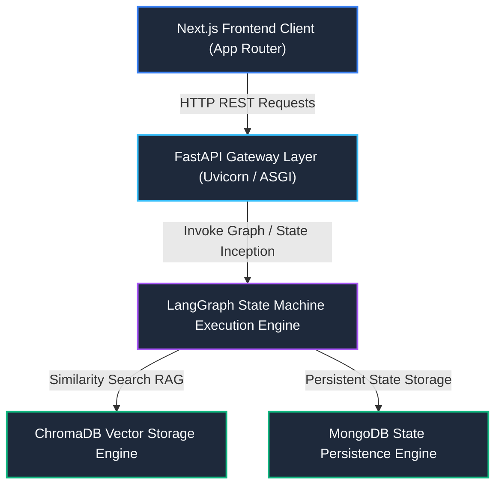
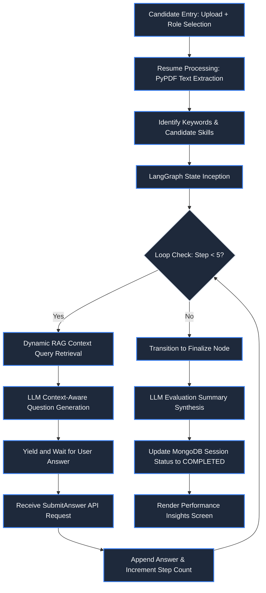

# AI-Powered Role-Based Candidate Screening System

This repository contains the architecture, backend engine, and conversational client interface for an automated candidate evaluation workspace. The system is designed to perform textbook-grounded, multi-turn technical screening assessments based on candidate resume profiles and target engineering roles.

---

## Tech Stack
- **Frontend**: `[Next.js 14 (App Router)]` `[React 18]` `[Tailwind CSS]` `[TypeScript]` `[Lucide Icons]`
- **Backend**: `[FastAPI]` `[Uvicorn]` `[Python 3.11]` `[Motor Async Driver]`
- **AI/ML Orchestration**: `[LangGraph]` `[LangChain]` `[Google Gemini API]`
- **Databases**: `[MongoDB]` `[ChromaDB (Vector Store)]`

---

## 1. Executive Summary and Objective

The objective of this system is to streamline the initial stages of technical recruitment by automating role-specific candidate evaluations. The system operates on three primary architectural pillars:

- **Adaptive Agentic Loops**: Orchestrated by LangGraph, the system guides candidates through a dynamic, 5-turn screening interview where subsequent questions are generated based on the evaluation of previous responses.
- **Automated Resume Extraction**: Candidates upload their resume (PDF), which is parsed using a zero-dependencies keyword extraction layer to identify relevant skills and target libraries.
- **Textbook-Grounded Retrieval (RAG)**: The generation engine interfaces with a local persistent vector store (ChromaDB), populated with domain-specific machine learning textbooks, to ground the conversation in authoritative source material.

By coupling structured database persistence (MongoDB) with state-machine agentic runtime (LangGraph), this workspace guarantees reliable candidate assessment transcripts and high-quality evaluation reports.

---

## 2. System Architecture Block Diagram

The complete system workspace is organized as a decoupled, multi-tier application. Below is the Mermaid block diagram representing the data flows and runtime dependencies:



---

## 3. Logical System Flow Diagram

The flowchart below maps the lifecycle of an active interview session from candidate ingestion to final report rendering:



---

## 4. AI/ML RAG Pipeline Specification

The system incorporates a Retrieval-Augmented Generation (RAG) framework to ensure the questions generated are anchored in validated academic literature rather than LLM parametric memory.

### Ingestion Mechanics
- **Document Ingestion**: Target PDF material (e.g., `./knowledge_base/ml_book.pdf`) is read using `PyPDFLoader` to cleanly extract text page-by-page.
- **Text Splitting**: Document strings are decomposed using `RecursiveCharacterTextSplitter`.
  - **Chunk Size**: 600 characters.
  - **Chunk Overlap**: 60 characters.
  - **Separators**: Paragraphs (`\n\n`), sentences (`\n`), words (` `), and empty strings (`""`).

### Vector Space Vectorization
- **Embeddings Model**: Configured to utilize Google GenAI `models/text-embedding-004` (or `text-embedding-3-small` for alternative OpenAI pathways).
- **Vector Base Store**: Persisted locally in a ChromaDB database collections index (`chroma_db/`), allowing for fast cosine similarity index lookups.

### Agentic Context Trajectory
Unlike standard linear chains which struggle with multi-turn conversation tracking, this system leverages a graph-based state router using LangGraph.
- **State Preservation**: The session details are managed inside the `InterviewState` structure.
- **Asynchronous Stateless Transitions**: The state is reloaded back into the graph via `.update_state(config, ...)` and resumed using `.invoke(None, config)`. This decouples the state execution from the stateless HTTP protocol of FastAPI.

---

## 5. Database Schema Designs

The persistence layer relies on MongoDB. Data models are mapped dynamically using Pydantic validation schemas.

### Collection: sessions

```json
{
  "_id": "UUID String (Session Identifier)",
  "role": "Target Job Position (String)",
  "skills": ["Array of extracted skill strings"],
  "status": "Current session state (ACTIVE | COMPLETED)",
  "current_step": "Current question turn (Integer, 1 to 5)",
  "max_questions": "Limit configuration (Integer, default 5)",
  "evaluation_summary": "Markdown string containing LLM evaluation (Nullable)",
  "created_at": "ISO DateTime String",
  "logs": [
    {
      "question": "Question text generated by LLM (String)",
      "answer": "Candidate response text (String, Nullable if current)",
      "timestamp": "ISO DateTime String"
    }
  ]
}
```

---

## 6. Comprehensive Local Setup Guide

Follow the instructions below to configure and launch the system components locally.

### Pre-requisites
- **Node.js**: Version 18.0.0 or higher.
- **Python**: Version 3.11.0 or higher.
- **MongoDB**: A running local or cloud instance.

### Environment Configurations
Create a `.env` file in the `backend/` directory based on the template below:

```env
# Gemini API Key (Required for LLM and Embeddings)
GEMINI_API_KEY=your_gemini_api_key_here

# OpenAI API Key (Optional fallback)
OPENAI_API_KEY=your_openai_api_key_here

# MongoDB Connection Properties
MONGODB_URL=mongodb://localhost:27017
MONGODB_DB_NAME=screener_db

# Application Configuration
APP_TITLE=PG AGI Screener API
MAX_INTERVIEW_QUESTIONS=5
```

### Backend Initialization Setup
Open a terminal workspace, navigate to the `backend/` directory, and perform the setup:

1. **Activate Python Virtual Environment**:
   ```powershell
   python -m venv .venv
   .venv\Scripts\activate
   ```
2. **Install Dependencies**:
   ```bash
   uv pip install -r requirements.txt
   ```
   *(Or standard pip if uv is not configured: `pip install -r requirements.txt`)*
3. **Launch local database (if required)**: Ensure MongoDB service is running locally on port 27017.
4. **Launch Backend Server**:
   ```bash
   python -m uvicorn main:app --reload --port 8000
   ```
   Verify the API endpoints by opening the interactive documentation page at `http://127.0.0.1:8000/docs`.

### Frontend Application Initialization
Open a new terminal workspace, navigate to the `frontend/` directory, and perform the setup:

1. **Install Node Packages**:
   ```bash
   npm install
   ```
2. **Start Web Client Development Server**:
   ```bash
   npm run dev
   ```
3. **Open Browser Viewport**: Access the interface at `http://localhost:3000`.

---

## 7. Development and Verification Tasks

Progress checklist for the implementation phase:

- [x] Ingestion Engine: PDF chunk parsing and vector db creation
- [x] State Machine Router: LangGraph conversation loops
- [x] Database Transition: Swapped SQLite for Motor MongoDB persistence
- [x] Client Interface: Interactive Next.js App Router workspace
- [x] Production Verification: Clean builds with type checking
