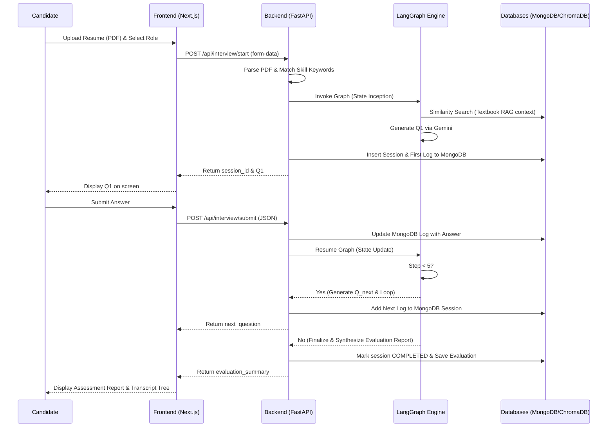
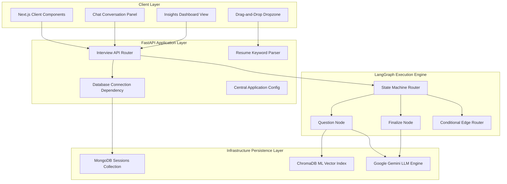
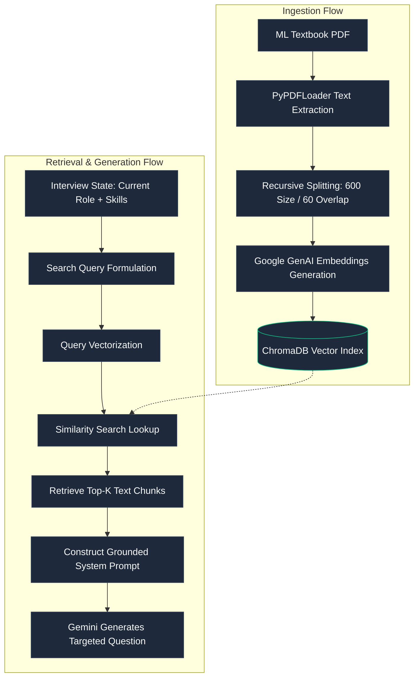

# AGI Screener

> The first agentic candidate evaluation system built using Next.js, FastAPI, and LangGraph — screen and grade technical hires autonomously using textbook-grounded retrieval.


---

Recruiting is slow. Ingesting resumes is manual. Standard tests are easily cheated by online models.

Until now.

AGI Screener is a complete candidate evaluation workspace that gives hiring managers the ability to autonomously configure, conduct, and grade conversational technical interviews. The questions are dynamic, customized to candidate skills, and grounded in authoritative textbooks through a local Retrieval-Augmented Generation (RAG) vector engine.

---

## Premium Visual & Grading Overhauls

We have introduced the following updates to align the client workspace with a high-performance design:
- **WriteMate-Inspired Dark Theme**: Implemented a deep pitch-dark background (`#090A0F`) layered with absolute-positioned blue radial gradient overlays, high-contrast pure white action buttons, translucent border parameters (`border-white/20`), and monospaced typography accents (`font-mono`).
- **Wider Two-Column Layout**: Refactored the candidate welcome page into a responsive dual-column grid structure (tagline checkpoints on the left, ingestion selector controls on the right) that fills the maximum layout width and eliminates margins.
- **Dynamic Q&A Interactions**: Configured automatic scrolling mechanisms to anchor viewport layouts to the latest messages, and focus trigger hooks to activate the inputs immediately upon new question generation.
- **In-App Markdown Parser**: Formats bold highlights (`**`), section headings (`#`/`##`), and bulleted items (`-`) dynamically inside the candidate summary dashboard, avoiding raw markdown text blocks.
- **Devil's Advocate Grading**: Integrated strict grading instructions in LLM evaluator node prompts and mock API handlers to score vague, brief, or placeholder responses severely (e.g. `0.5 / 10` or `3.5 / 10`).

---

## How It Works



---

## Architecture



---

## RAG Flow



---

## Ingestion and RAG Specifications

To ensure the screening questions remain grounded and relevant, the system extracts context from core textbook reference material:

| Parameter | Configuration | Purpose |
|---|---|---|
| Ingestion Tool | `PyPDFLoader` | Reads target text cleanly page-by-page |
| Split Strategy | `RecursiveCharacterTextSplitter` | Breaks documents into semantic segments |
| Chunk Size | 600 characters | Retains concise, highly contextual blocks |
| Chunk Overlap | 60 characters | Retains context continuity between boundaries |
| Embeddings Model | `models/text-embedding-004` | High-accuracy Google GenAI embeddings mapping |
| Vector Store | ChromaDB | Local disk-persisted vector search indexing |

---

## API Reference

### Endpoints

| Endpoint | Method | Request Body | Description |
|---|---|---|---|
| `/api/interview/start` | POST | `multipart/form-data` (PDF + Role) | Parses resume, generates Q1, inserts session state |
| `/api/interview/submit` | POST | `JSON` (Session ID + Answer) | Appends answer, advances graph, returns next Q or report |
| `/api/interview/summary/{id}`| GET | None | Retrieves complete Q/A transcript and grading details |

---

## Environment Variables

Configure these settings inside `backend/.env`:

| Variable | Required | Default | Description |
|---|---|---|---|
| `GEMINI_API_KEY` | Yes | — | Google Gemini LLM API authorization key |
| `MONGODB_URL` | No | `mongodb://localhost:27017` | URI connection string for MongoDB instance |
| `MONGODB_DB_NAME` | No | `screener_db` | Collection database name inside MongoDB |
| `APP_TITLE` | No | `PG AGI Screener API` | Name identifier for FastAPI application |
| `MAX_INTERVIEW_QUESTIONS`| No | `5` | Turns limit before evaluation finalization |

---

## Local Setup

### System Pre-requisites
- Node.js version 18.0.0 or higher
- Python version 3.11.0 or higher
- Active local or cloud instance of MongoDB

### Backend Startup

Run these commands inside the `backend/` directory:

1. **Activate Python Virtual Environment**:
   ```powershell
   python -m venv .venv
   .venv\Scripts\activate
   ```
2. **Install Package Dependencies**:
   ```bash
   uv pip install -r requirements.txt
   ```
   *(Or standard pip if uv is not configured: `pip install -r requirements.txt`)*
3. **Start FastAPI Application Server**:
   ```bash
   python -m uvicorn main:app --reload --port 8000
   ```

Verify route registration by visiting: `http://127.0.0.1:8000/docs`

---

### Frontend Startup

Run these commands inside the `frontend/` directory:

1. **Install Node Packages**:
   ```bash
   npm install
   ```
2. **Start Web Client Development Server**:
   ```bash
   npm run dev
   ```

Access the client application by visiting: `http://localhost:3000`

---

## Why LangGraph for Interviews

| Feature | LangGraph State Machine | Standard Linear Chain |
|---|---|---|
| Conversation Loop Routing | Non-linear routing based on step counters | Strictly linear pipeline execution |
| Memory Management | Persistent checkpointer (thread-scoped) | Stateless context payload builder |
| Yielding State Mid-Flow | Supported (pauses at END awaiting inputs) | Not supported (requires full run execution) |
| Non-Blocking REST Integration | Highly viable (stateless load-save logic) | Requires manually passing chat history |

---

## Roadmap

**Now — Complete Local Workspace**
- Zero-dependency PDF parsing and skill matching.
- Asynchronous FastAPI endpoints with embedded logs.
- Dynamic 5-step conversational agentic interview workspace.
- MongoDB document mapping configuration.

**Next — RAG Database Hook**
- Connect the placeholder retrieval node with live local ChromaDB collections.
- Expand tech keyword indexing matching logic.

**Future — Custom Screen Templates**
- Support manager-defined textbook uploads per role.
- Custom grading score benchmarks.

---

## Tech Stack

- **Frontend**: Next.js 14, React 18, Tailwind CSS, TypeScript, Lucide Icons, Framer Motion
- **Backend**: FastAPI, Uvicorn, Python 3.11, Motor Async MongoDB Driver
- **AI/ML Engine**: LangGraph, LangChain, Google Gemini API
- **Persistence**: MongoDB, ChromaDB

---

## Contributing

Pull requests are welcome. For major changes, please open an issue first to discuss options.

---

## License

MIT — see [LICENSE](./LICENSE)
