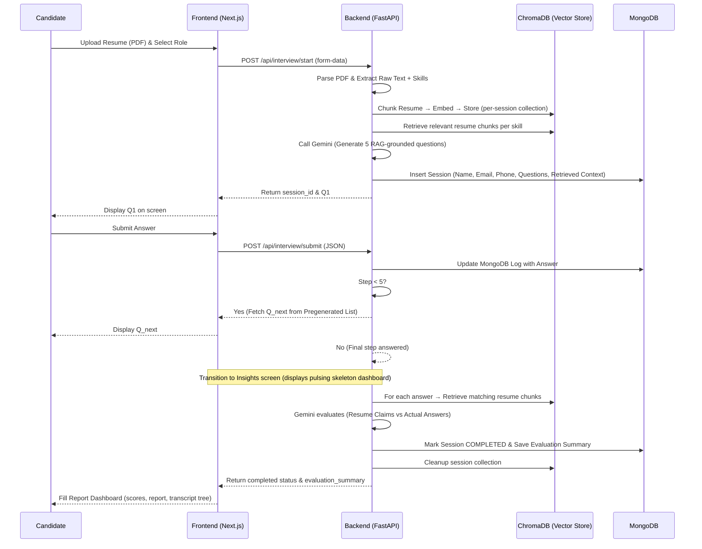
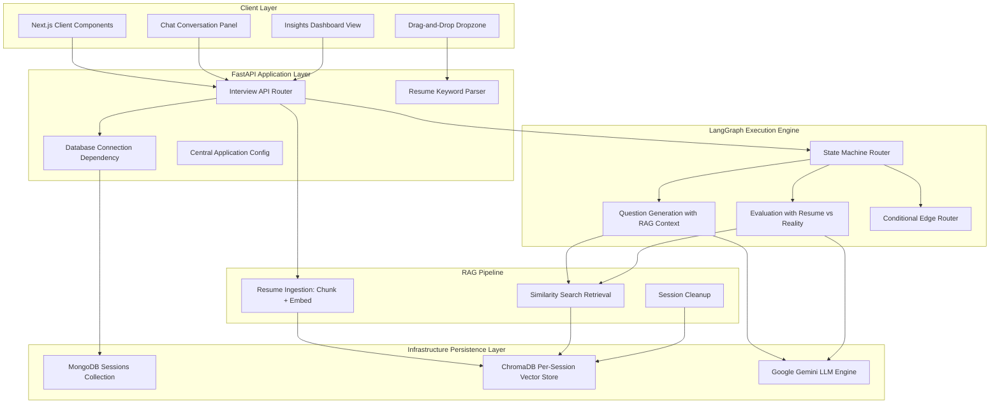
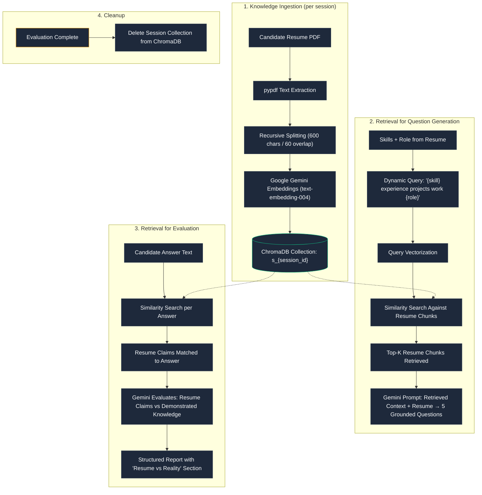

# AGI Screener

> The first agentic candidate evaluation system built using Next.js, FastAPI, and LangGraph — screen and grade technical hires autonomously using resume-grounded retrieval-augmented generation.


---

Recruiting is slow. Ingesting resumes is manual. Standard tests are easily cheated by online models.

Until now.

AGI Screener is a complete candidate evaluation workspace that gives hiring managers the ability to autonomously configure, conduct, and grade conversational technical interviews. Questions are dynamically generated from the candidate's own resume using a full RAG pipeline — the resume is chunked, embedded, stored in a vector database, and retrieved to ground every question and evaluation in what the candidate actually claims to know.


## How It Works



---

## Architecture



---

## RAG Pipeline

The RAG pipeline uses the **candidate's uploaded resume** as the knowledge base document. Each interview session gets its own isolated vector store collection.

### Flow



### Design Choices

| Parameter | Configuration | Rationale |
|---|---|---|
| Knowledge Source | Candidate's uploaded resume PDF | Questions probe what the candidate *claims* to know — the resume IS the knowledge base |
| Collection Scope | Per-session (`s_{session_uuid}`) | Isolates each candidate's data; enables parallel interviews |
| Split Strategy | `RecursiveCharacterTextSplitter` | Preserves semantic boundaries (paragraphs → sentences → words) |
| Chunk Size | 600 characters | Retains concise, contextual blocks covering resume sections |
| Chunk Overlap | 60 characters | Maintains context continuity across chunk boundaries |
| Embeddings Model | `models/text-embedding-004` | Google's latest high-accuracy embedding model |
| Vector Store | ChromaDB (local disk-persisted) | Zero-infrastructure vector search; persists across restarts |
| Retrieval (Questions) | Per-skill queries, top-3 per skill, deduplicated, max 10 chunks | Ensures questions cover multiple resume areas |
| Retrieval (Evaluation) | Per-answer similarity search, top-3 chunks | Cross-references what resume claims vs what candidate demonstrated |
| Cleanup Policy | Delete collection after evaluation | Keeps storage clean on deployment |

### Traceability (Context → Question → Answer → Storage)

Every question stored in MongoDB includes a `retrieved_context` field — an array of the exact resume chunks that were retrieved from ChromaDB and used to generate that question. This provides full traceability of the RAG pipeline:

```json
{
  "question": "You mentioned implementing a RAG pipeline with LangChain...",
  "answer": "I used RecursiveCharacterTextSplitter with...",
  "retrieved_context": [
    "Built an AI-powered document retrieval system using LangChain, ChromaDB...",
    "Implemented RAG pipeline for knowledge-grounded question answering..."
  ],
  "timestamp": "2026-07-07T12:30:00Z"
}
```

---

## API Reference

### Endpoints

| Endpoint | Method | Request Body | Description |
|---|---|---|---|
| `/api/interview/start` | POST | `multipart/form-data` (PDF + Role) | Parses resume, ingests into ChromaDB, generates 5 RAG-grounded questions, returns Q1 |
| `/api/interview/submit` | POST | `JSON` (Session ID + Answer) | Records answer, advances to next question or triggers RAG-verified evaluation |
| `/api/interview/summary/{id}`| GET | None | Retrieves complete Q/A transcript with retrieved context and evaluation report |

---

## Environment Variables

### Backend Configuration
Configure these settings inside `backend/.env`:

| Variable | Required | Default | Description |
|---|---|---|---|
| `GEMINI_API_KEY` | Yes | — | Google Gemini LLM API authorization key |
| `MONGODB_URL` | No | `mongodb://localhost:27017` | URI connection string for MongoDB instance |
| `MONGODB_DB_NAME` | No | `screener_db` | Collection database name inside MongoDB |
| `APP_TITLE` | No | `PG AGI Screener API` | Name identifier for FastAPI application |
| `MAX_INTERVIEW_QUESTIONS`| No | `5` | Turns limit before evaluation finalization |

### Frontend Configuration
Configure these settings inside `frontend/.env`:

| Variable | Required | Default | Description |
|---|---|---|---|
| `NEXT_PUBLIC_API_URL` | No | `http://localhost:8000` | Backend API base URL for fetch requests |

---

## Local Setup

### System Pre-requisites
- Node.js version 18.0.0 or higher
- Python version 3.11.0 or higher
- Active local or cloud instance of MongoDB

### Backend Startup

Run these commands inside the `backend/` directory:

1. **Activate Python Virtual Environment**:
   ```powershell
   python -m venv .venv
   .venv\Scripts\activate
   ```
2. **Install Package Dependencies**:
   ```bash
   uv pip install -r requirements.txt
   ```
   *(Or standard pip if uv is not configured: `pip install -r requirements.txt`)*
3. **Start FastAPI Application Server**:
   ```bash
   python -m uvicorn main:app --reload --port 8000
   ```

Verify route registration by visiting: `http://127.0.0.1:8000/docs`

---

### Frontend Startup

Run these commands inside the `frontend/` directory:

1. **Install Node Packages**:
   ```bash
   npm install
   ```
2. **Start Web Client Development Server**:
   ```bash
   npm run dev
   ```

Access the client application by visiting: `http://localhost:3000`

---

## Project Structure

```
pg-agi-screener/
├── backend/
│   ├── app/
│   │   ├── api/
│   │   │   └── interview.py          # FastAPI routes (start, submit, summary)
│   │   ├── core/
│   │   │   ├── config.py             # Pydantic settings from .env
│   │   │   └── database.py           # Motor async MongoDB client
│   │   ├── rag/
│   │   │   └── ingest.py             # RAG pipeline: chunk, embed, store, retrieve, cleanup
│   │   ├── schemas/
│   │   │   └── interview.py          # Pydantic request/response/DB models
│   │   └── services/
│   │       ├── interview_graph.py    # LangGraph state machine + Gemini Q&A generation
│   │       └── resume_parser.py      # PDF text/skill extraction
│   ├── chroma_db/                    # ChromaDB persistent storage (auto-created)
│   ├── main.py                       # FastAPI app entry point
│   └── requirements.txt
├── frontend/
│   └── src/
│       ├── app/
│       │   ├── page.tsx              # Main UI: Welcome → Chat → Insights
│       │   ├── layout.tsx            # Root layout
│       │   └── globals.css           # Global styles
│       ├── components/ui/            # Reusable UI components
│       └── lib/                      # Utilities
└── README.md
```

---

## Why LangGraph for Interviews

| Feature | LangGraph State Machine | Standard Linear Chain |
|---|---|---|
| Conversation Loop Routing | Non-linear routing based on step counters | Strictly linear pipeline execution |
| Memory Management | Persistent checkpointer (thread-scoped) | Stateless context payload builder |
| Yielding State Mid-Flow | Supported (pauses at END awaiting inputs) | Not supported (requires full run execution) |
| Non-Blocking REST Integration | Highly viable (stateless load-save logic) | Requires manually passing chat history |

---

## Key Features

- **Resume-as-Knowledge-Base RAG** — The candidate's resume is chunked, embedded, and stored in ChromaDB. Questions are generated from retrieved resume sections, not generic templates.
- **Resume vs Reality Evaluation** — During grading, each answer is similarity-searched against resume chunks to explicitly compare what the candidate claimed vs what they demonstrated.
- **Full Traceability** — Every question stores the exact resume chunks that influenced its generation (`retrieved_context` field in MongoDB).
- **Per-Session Vector Isolation** — Each candidate gets their own ChromaDB collection, deleted after evaluation.
- **Devil's Advocate Grading** — Strict evaluation with scores as low as 0.5/10 for placeholder answers.
- **Zero-Dependency PDF Parsing** — pypdf-based extraction with regex skill matching.
- **Skeleton Loading States** — Premium pulsing skeleton dashboard while evaluation generates.

---

## Tech Stack

- **Frontend**: Next.js 14, React 18, Tailwind CSS, TypeScript, Lucide Icons, Framer Motion
- **Backend**: FastAPI, Uvicorn, Python 3.11, Motor Async MongoDB Driver
- **AI/ML Engine**: LangGraph, LangChain, Google Gemini API, ChromaDB
- **Embeddings**: Google `text-embedding-004` via `langchain-google-genai`
- **Vector Store**: ChromaDB (local disk-persisted, per-session collections)
- **Persistence**: MongoDB (sessions, logs, evaluation reports)

---

## Contributing

Pull requests are welcome. For major changes, please open an issue first to discuss options.

---

## License

MIT — see [LICENSE](./LICENSE)
